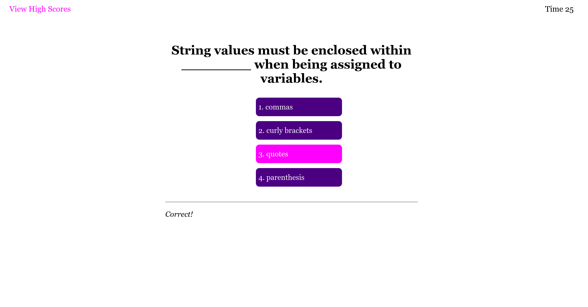

# Code Quiz

## Purpose
As a coding boot camp student, I want to take a timed quiz on JavaScript fundamentals that stores high scores so that I can gauge my progress compared to my peers

## Built With
* HTML
* CSS
* JavaScript

## Website
https://akman47.github.io/code-quiz

## Snapshot

## Criteria
* GIVEN I am taking a code quiz
* WHEN I click the start button
THEN a timer starts and I am presented with a question
* WHEN I answer a question
THEN I am presented with another question
* WHEN I answer a question incorrectly
THEN time is subtracted from the clock
* WHEN all questions are answered or the timer reaches 0
THEN the game is over
* WHEN the game is over
THEN I can save my initials and score

## Contribution
Made by Angela Man